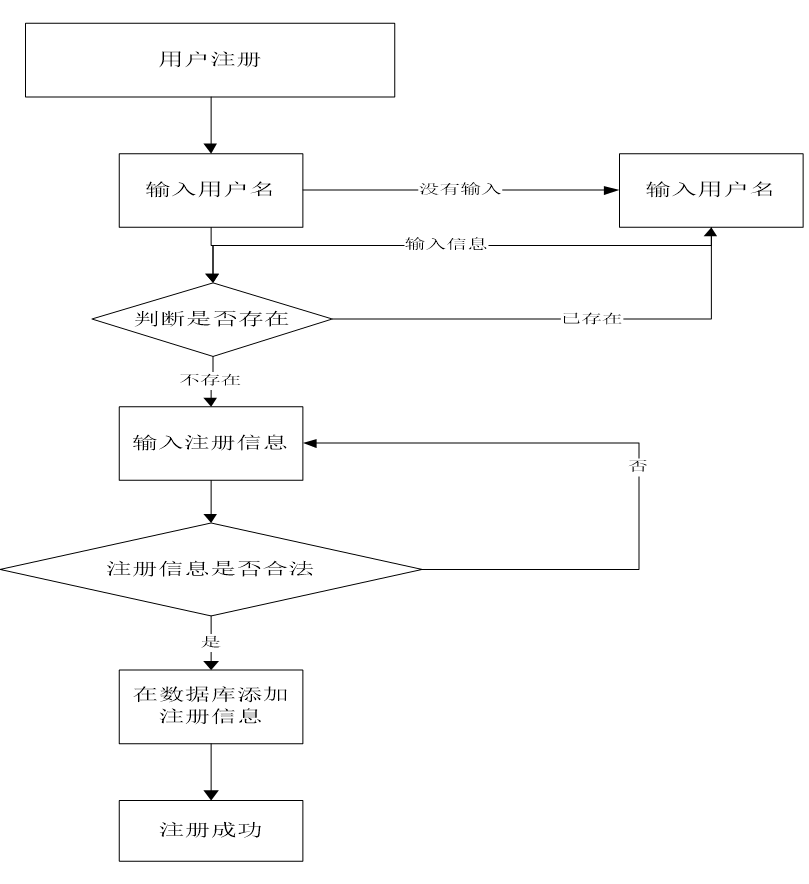
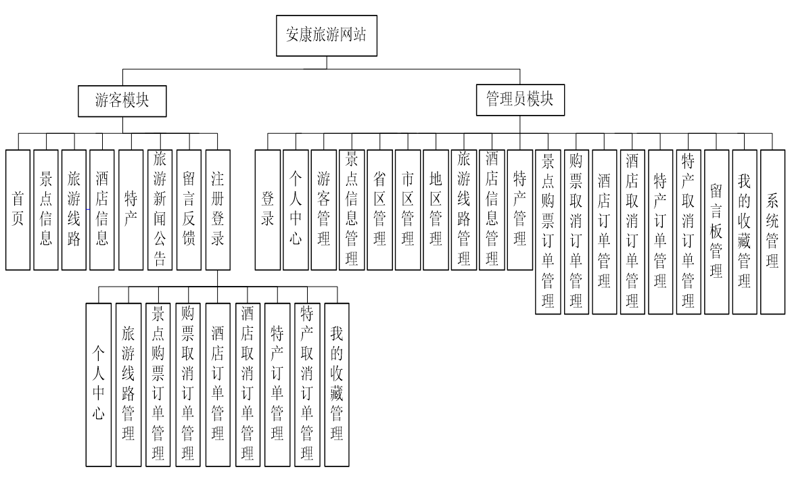
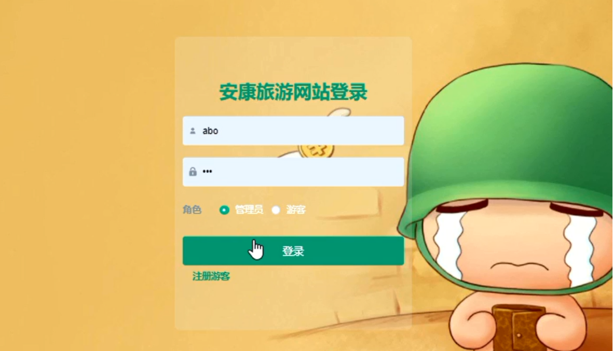
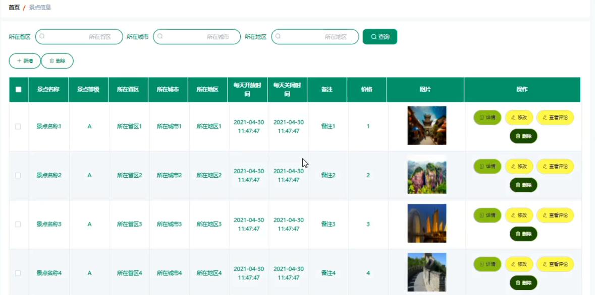
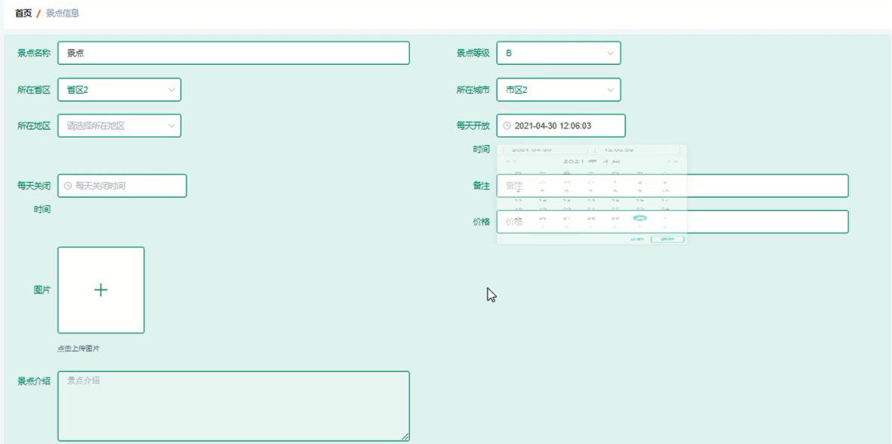
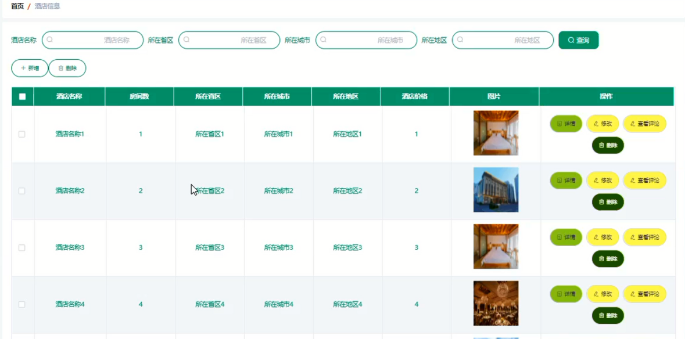
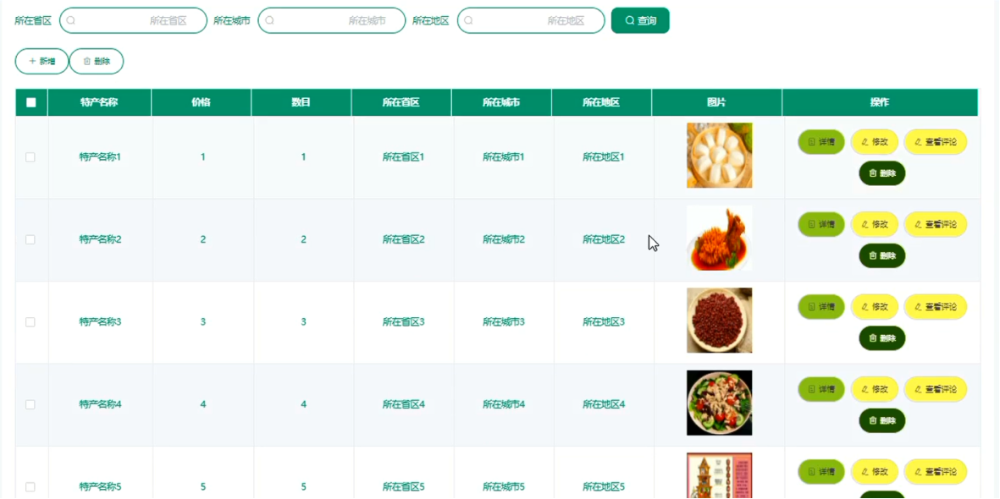
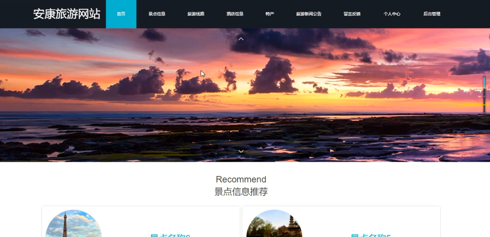
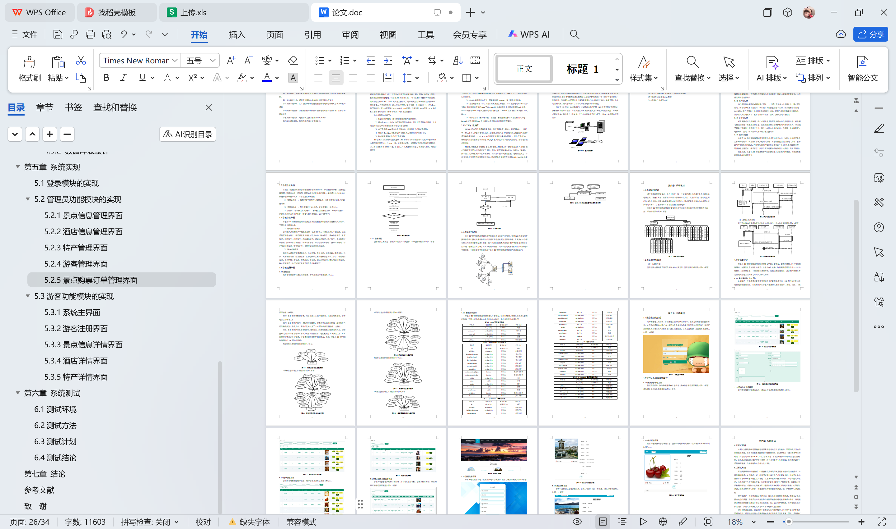

# springboot087-基于SpringBoot的安康旅游网站的设计与实现

>  博主介绍：
>  Hey，我是程序员Chaers，一个专注于计算机领域的程序员
>  十年大厂程序员全栈开发‍ 日常分享项目经验 解决技术难题与技术推荐 承接各类网站设计，小程序开发，毕设等。
>  【计算机专业课程设计，毕业设计项目，Java，微信小程序，安卓APP都可以做，不仅仅是计算机专业，其它专业都可以】

## 3000套系统可挑选，获取链接：https://chaerspol.github.io/

<b>QQ【获取完整源码】：674456564</b>

<b>QQ群【获取完整源码】：1058861570</b>

### 系统架构

> 前端：html | js | css | jquery | vue
>
> 后端：springboot | mybatis
> 
> 环境：jdk1.8+ | mysql | maven

# 一、内容包括
包括有  项目源码+项目论文+数据库源码+答辩ppt+远程调试成功

# 二、运行环境

> jdk版本：1.8 及以上； ide工具：IDEA； 数据库: mysql5.7及以上；编程语言: Java

# 三、需求分析

**3.1可行性分析**

对所有的系统来说，都有可能会受到时间和空间上的制约。所以，我们在设计每一个项目的时候，必须对该系统实行可行性分析，这样不但能够降低项目的危害，还能改降低人力、物力和财力的损耗。下面对技术、经济、操作和法律四个方面进行介绍。

**3.1.1技术可行性**

技术可行性是指学习的技术是否能够完成本项目，如果团队本身没有相关的技术储备，而又能够迅速掌握此类技术，那项目应该达不到我们的设计要求。本文将开发的系统，将采用的关键技术包括JSP技术、Java编程语言、Spring Boot框架、MYSQL数据库存储技术等。大学时将这些技术已经学习掌握，因此，就技术层面而言，该项目的开发是有保障的。

**3.1.2 操作可行性**

操作可行性主要是针对系统用户而言，一个系统再完美，技术再先进，用户不去使用，或者用户根本不会使用，该系统存在的价值也是不大的。本系统拟采用的是B/S架构，用户只要通过点击浏览器即可轻松访问，而用户对浏览器操作非常熟练，所以从用户的角度而言，没有任何学习成本，因此，操作上是可行性的。

**3.1.3 经济可行性**

项目需要考虑花费问题，我们必须考虑系统开发中所有的花费进行计算，我们要考虑到系统需不需要太大的资金。二是系统开发后期维护相关的费用大不大。本系统采用我们开源的技术没进行设计，再设计中没有太多的花费，只需要一台电脑便可以进行开发，因此，该项目的实施在经济上完全可行。

**3.1.4 法律可行性**

本基于SpringBoot的安康旅游网站开发的所有技术资料都为合法，知识产权问题不会发生在开发过程中，而且没有抄袭其他相关系统，不会有侵犯版权的问题。另外，基于SpringBoot的安康旅游网站设计与开发所采用的操作和工作方式符合工作人员的日常习惯，而且操作方便灵活，便于管理。所以在开发过程中不会涉及法律责任，具有可行性；
综上所述，该基于SpringBoot的安康旅游网站在建设上不存在较大的障碍，各方面都能够保障系统的顺利开发。

**3.2系统性能分析**

系统除了功能结构设计以外还需要附加需求的分析，非功能需求分析，主要是包括界面、数据库问题、框架等，需要满足非功能性能的需求，保证系统运行起来的时候能够达到最佳的效果，保证稳定性和安全性。

（1）数据底层统一。数据传输中需要进行数据处理，在查询数据存储上达到最佳效果。

（2）界面风格统一。图片需要进行PS处理，文字需要统一格式大小。

（3）数据库。每个模块都需要独立，各个模块之间相互配合，形成一个整体，包装各个功能合理化的配置，需要考虑开放端口，满足可扩展性。

**3.3系统功能分析**

本基于SpringBoot的安康旅游网站主要包括游客功能模块和管理员功能模块两大部分，下面分别介绍其功能：

（1）管理员功能模块

管理员是这两类用户中权限最高的，管理员登录后可对系统进行全面管理，确保系统正常稳定运行，管理员主要功能包括个人中心、游客管理、景点信息管理、省区管理、市区管理、地区管理、旅游线路管理、酒店信息管理、特产管理、景点购票订单管理、购票取消订单管理、酒店订单管理、酒店取消订单管理、特产订单管理、特产取消订单管理、留言板管理、我的收藏管理和系统管理。

（2）游客功能模块

游客进入系统可查看系统信息，包括首页、景点信息、旅游线路、酒店信息、特产、旅游新闻公告、留言反馈等，注册登录后主要功能模块包括个人中心、旅游线路管理、景点购票订单管理、购票取消订单管理、酒店订单管理、酒店取消订单管理、特产订单管理、特产取消订单管理以及我的收藏管理。

**3.4系统流程分析**

# 四、功能模块

对于本系统的开发设计，先自上向下，将一个完整的系统分解成许多个小系统来进行实现；再自下向上，将所有的“零件”组装成一个大的、完整的系统。因此这里面的许多个小功能块都要对将要实现的功能进行划分，同时还要给其他的小功能模块提供调用的接口，以便于最后将所有的功能块组合起来。本基于SpringBoot的安康旅游网站主要实现了游客功能模块和管理员功能模块两大部分，系统结构图如图

# 五、效果图展示【部分效果图】

图5.1  系统登录界面【用户要想进入本系统，必须通过正确的用户名和密码，选择登录类型进行登录操作，在登录时系统会以用户名、密码和登录类型为参数进行登录信息的验证，信息正确则登录进入对应用户功能界面可进行功能处理，反之登录失败，系统登录界面展示如图】

图5.2 景点信息管理界面【管理员可添加、修改和删除景点信息信息，景点信息管理界面展示如图】

图5.3  添加景点信息信息界面【添加景点信息信息界面展示如图】

图5.4  酒店信息管理界面【管理员可增删改查酒店信息，酒店信息管理界面展示如图】

图5.5  特产管理界面【管理员可增删改查特产信息，特产管理界面展示如图】

图5.6 系统主界面【游客进入本系统可查看系统信息，系统主界面展示如图】

 <b>完整文章</b>
 
 
 

## 3000套系统可挑选，获取链接：https://chaerspol.github.io/

<b>QQ【获取完整源码】：674456564</b>

<b>QQ群【获取完整源码】：1058861570</b>

